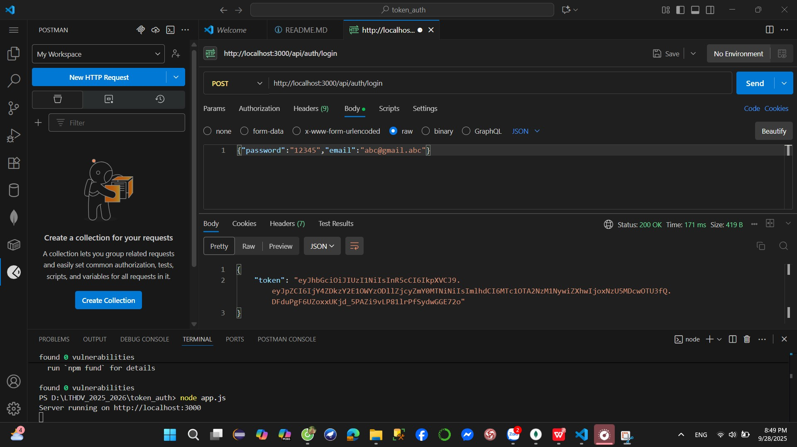

Token Authentication
This project demonstrates authentication using JWT (JSON Web Token) with Node.js, Express, and MongoDB.

1. Run Server
Install dependencies:

npm install
Run server:

node app.js
Server will run on: 👉 http://localhost:3000

2. API Testing with Postman
We use Postman to test all APIs.

a. Go to Profile (without token)
Endpoint: GET /api/auth/profile
Header: (no Authorization header)
Expected result:
{ "error": "Access denied" }

b. Register
Endpoint: POST /api/auth/register
Body (JSON):
{
  "username": "admin",
  "email": "admin@example.com",
  "password": "12345"
}
Expected result:
{ "message": "User registered successfully!" }

c. Login
Endpoint: POST /api/auth/login
Body (JSON):
{
  "email": "admin@example.com",
  "password": "12345"
}
Expected result:
{ "token": "<JWT_TOKEN>" }

👉 Copy the token from response for later use.

d. Go to Profile with token
Endpoint: GET /api/auth/profile
Header:
Authorization: Bearer <JWT_TOKEN>
Expected result: Returns user information (without password).
Example:

{
  "_id": "650f...",
  "username": "admin",
  "email": "admin@example.com"
}

3. Token Expiration
In auth.js, inside the login route, token is generated as:

const token = jwt.sign({ id: user._id }, "secretKey", { expiresIn: "1h" });
expiresIn: "1h" → token expires in 1 hour.
You can change it to:
30 seconds: { expiresIn: "30s" }
5 minutes: { expiresIn: "5m" }
1 day: { expiresIn: "1d" }
👉 After expiration, any request to /api/auth/profile with that token will return:

{ "error": "Invalid token" }
4. Notes
JWTs are stateless: server does not store them, client must send on every request.
Always include token in the header:
Authorization: Bearer <JWT_TOKEN>
Changing the secretKey in code will invalidate all previous tokens.